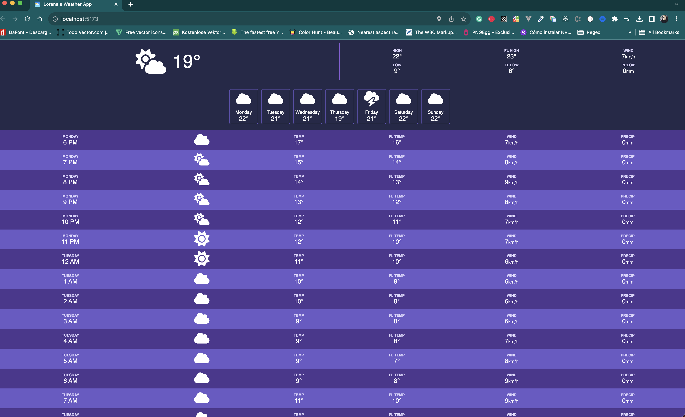
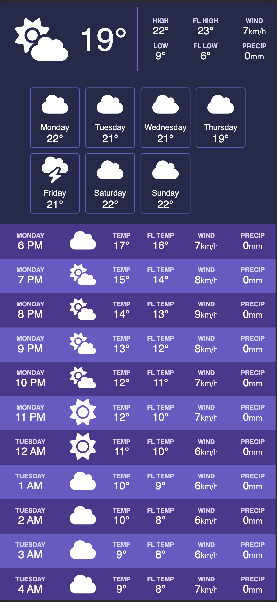

# Weather APP WITH VANILLA JS - Lorena Infante

This is the first version of a weather app using vanilla js, css and html.
The main objective of developing this app was to practice every content related to promises, callbacks, destructuring, getting data and consuming open APIs.
I have used https://open-meteo.com/en/docs to get the metereological data, and inspired the design on a free Figma mockup.

## Desktop

## Mobile

